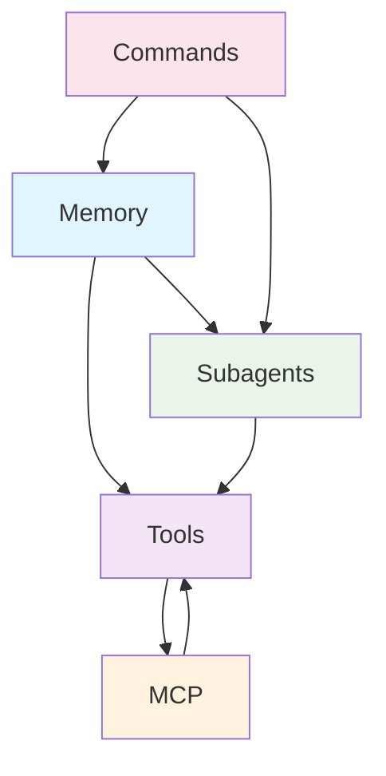

# Claude Code Framework Elementer

De 5 kerneelementer i AI-assisteret udvikling.

## Hukommelse (Memory)

**Persistering af projektspecifik viden**

- 📁 **CLAUDE.md filer**: Hierarkisk system (Enterprise → Projekt → Bruger)
- 🧠 **Kontekst bevaring**: LLM'en husker kodestandarder og workflows
- 📚 **Import system**: Modulær organisation med `@path/to/file`

## Værktøjer (Tools)

**Direkte system integration**

- 📝 **Filsystem adgang**: Read, Write, Edit for kodemanipulation
- 💻 **Terminal integration**: Bash kommandoer direkte i workflow
- 🌐 **Web capabilities**: WebFetch/WebSearch for research

## MCP Servers

**AI-native API integrationer**

- 🔌 **Eksterne tjenester**: GitHub, Linear, Sentry, Stripe osv.
- 🎯 **Semantisk data**: Direkte til LLM kontekst, ikke JSON parsing
- 🔐 **OAuth authentication**: Sikker adgang til cloud services

## Subagenter

**Specialiserede AI eksperter**

- 🎭 **Dedikerede roller**: code-reviewer, debugger, test-runner
- 🧠 **Separat kontekst**: Eget kontekstvindue per agent
- 🔧 **Konfigureret adgang**: Kun relevante værktøjer per agent

## Slash Commands

**Hurtig workflow kontrol**

- ⚡ **Built-in commands**: `/memory`, `/agents`, `/cost`, `/mcp`
- 📋 **Custom commands**: Genbrugelige prompts som Markdown filer
- 🔄 **Parameterisering**: `$ARGUMENTS` og system integration

---

## Framework Relations

**Sammen skaber disse 5 elementer et sammenhængende ecosystem hvor AI'en altid har den rigtige kontekst og værktøjer.**